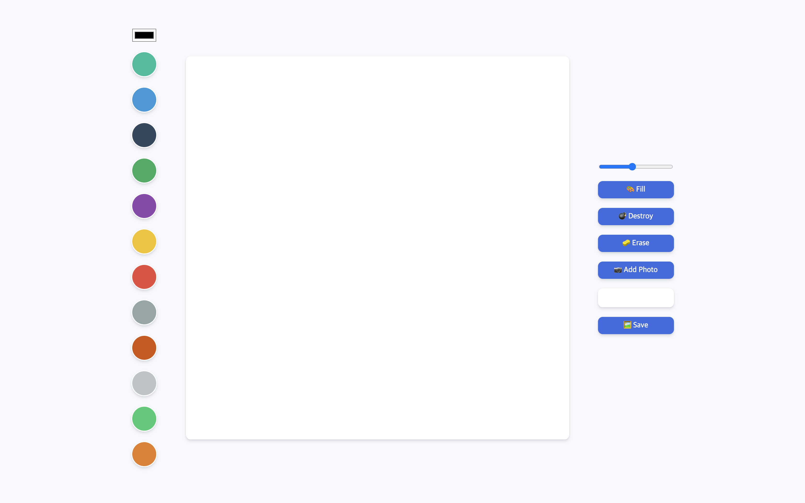

<h1>Meme maker</h1>

Meme maker application created with JavaScript and the Canvas API

 

### Try it out!

### [Click here 👈](https://etihadstadium.github.io/meme-maker/)

 

### Meme maker 프로젝트

이 프로젝트는 `canvas`를 이용하여 만들어진 그림판입니다.  
이 프로젝트는 `JavaScript`를 통해 구현하였습니다.

 

---

 

Meme maker

 
